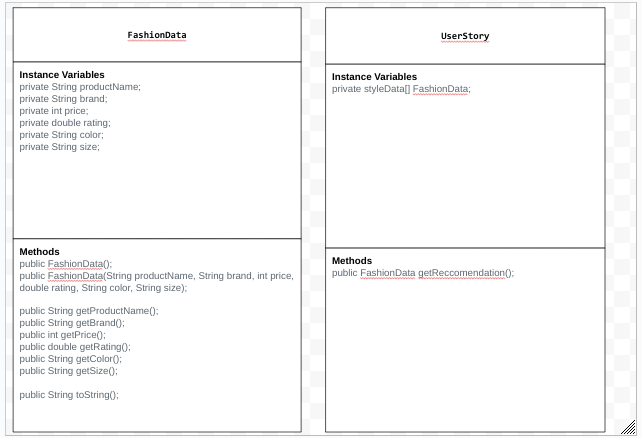

# Unit 3 - Data for Social Good Project 

## Introduction 

Software engineers develop programs to work with data and provide information to a user. Each user has different needs based on the information they are looking for from data. Your goal is to create a data analysis program for your user that stores and analyzes data to provide the information they need. 

## Requirements 

Use your knowledge of object-oriented programming, one-dimensional (1D) arrays, and algorithms to create your data analysis program: 
- **Write a class** – Write a class to represent your user or business and store and analyze their data with no-argument and parameterized constructors. 
- **Create at least two 1D arrays** – Create at least two 1D arrays to store the data that your user needs information about. 
- **Write a method** – Write a method that finds or manipulates the elements in a 1D array to provide the information your user needs. 
- **Implement a toString() method** – Write a toString() method that returns general information about the data (for example, number of values in the dataset). 
- **Document your code** – Use comments to explain the purpose of the methods and code segments and note any preconditions and postconditions. 

## User Story 

Include your User Story you analyzed for your project here. Your User Story should have the following format: 

> As a fashion designer,   
> I want to gather data from my clients,   
> so that I can find clothing that best suits their needs and wants. 

## Dataset 

Include a hyperlink to the source of your dataset used for this project. Additionally, provide a short description of each column used from the dataset, and the data type. 

Dataset: https://www.kaggle.com/datasets/bhanupratapbiswas/fashion-products/data  
- **Product Name** (String) - name of the product / item
- **Brand** (String) - brand of the item
- **Price** (int) - price of the item
- **Rating** (double) - rating of the item
- **Color** (String) - color of the item
- **Size** (String) - size of the item

## UML Diagram 

Put and image of your UML Diagram here. Upload the image of your UML Diagram to your repository, then use the Markdown syntax to insert your image here. Make sure your image file name is one work, otherwise it might not properly get display on this README. 

 

## Description 

This project focuses on creating a recommendation system for a fashion designer, helping users find clothing items that best suit their needs. The system is built with object-oriented principles and uses a dataset of fashion products that includes details like product name, brand, price, rating, color, and size. The UserStory class is responsible for managing the collection of FashionData objects, initializing them from external text files (such as product name, brand, price, etc.), and storing them in an array. It includes a method getRecommendation(), which prompts the user for input -- style (product name), maximum price, and size, and then filters the dataset to find matching products based on these preferences. If a match is found, the program outputs the details of the recommended product; otherwise, it informs the user that no match is available. The program interacts with the user using the Scanner class to gather input. The dataset, sourced from Kaggle, contains columns for product name, brand, price, rating, color, and size, with each column represented as arrays in the code.
